# KMS Encryption/Decryption Flow - Activity Diagram

```mermaid
flowchart TB
    subgraph SETUP["ONE-TIME KMS SETUP (Terraform)"]
        direction TB
        S1[DevOps runs Terraform] --> S2[Create RSA-4096\nAsymmetric KMS Key]
        S2 --> S3[AWS KMS generates\nKey Pair]
        S3 --> S4{Key Pair Created}
        S4 --> S5[Private Key stored\nin KMS HSM\n&#40;never leaves AWS&#41;]
        S4 --> S6[Export Public Key\nvia GetPublicKey API]
        S6 --> S7[Save public-key.pem\nto client resources]
        S7 --> S8[Share Public Key\nwith 3rd Party Client]
    end

    subgraph CLIENT["CLIENT ENCRYPTION PROCESS (No AWS SDK)"]
        direction TB
        C1[Client loads\npublic-key.pem] --> C2[Client has sensitive data\n&#40;e.g., credit card&#41;]
        C2 --> C3[Initialize RSA-OAEP\nCipher with SHA-256]
        C3 --> C4[Encrypt data with\nPublic Key]
        C4 --> C5[Base64 encode\nencrypted bytes]
        C5 --> C6[Create JSON payload\nwith encrypted field]
        C6 --> C7[POST request to\nCompany API endpoint]
    end

    subgraph BACKEND["COMPANY BACKEND DECRYPTION (AWS KMS)"]
        direction TB
        B1[REST Controller receives\nencrypted request] --> B2[Extract encrypted\ncreditCardNumber field]
        B2 --> B3[Base64 decode to\nencrypted bytes]
        B3 --> B4[Build KMS DecryptRequest\nwith key ARN]
        B4 --> B5[Set algorithm:\nRSAES_OAEP_SHA_256]
        B5 --> B6[Call KMS Decrypt API]
        B6 --> B7[KMS uses Private Key\nin HSM to decrypt]
        B7 --> B8[Return decrypted\nplaintext bytes]
        B8 --> B9[Convert to String\n&#40;UTF-8&#41;]
        B9 --> B10[Process decrypted data\n&#40;mask & store&#41;]
        B10 --> B11[Return success response\nwith masked data]
    end

    SETUP --> CLIENT
    CLIENT --> BACKEND

    style SETUP fill:#e1f5fe,stroke:#01579b
    style CLIENT fill:#fff3e0,stroke:#e65100
    style BACKEND fill:#e8f5e9,stroke:#1b5e20
```

## Flow Summary

### 1. One-Time KMS Setup
- **Actor**: DevOps/Infrastructure Team
- **Tools**: Terraform + AWS KMS
- **Output**: RSA-4096 asymmetric key pair (public key exported, private key secured in KMS)

### 2. Client Encryption Process
- **Actor**: 3rd Party Client (NO AWS account needed)
- **Tools**: Standard Java crypto (RSA-OAEP with SHA-256)
- **Input**: Sensitive PII data (credit card, SSN, etc.)
- **Output**: Base64-encoded encrypted data sent via REST API

### 3. Company Backend Decryption
- **Actor**: Company's Spring Boot Backend
- **Tools**: AWS KMS SDK
- **Security**: Private key NEVER leaves AWS KMS HSM
- **Output**: Decrypted plaintext for processing
